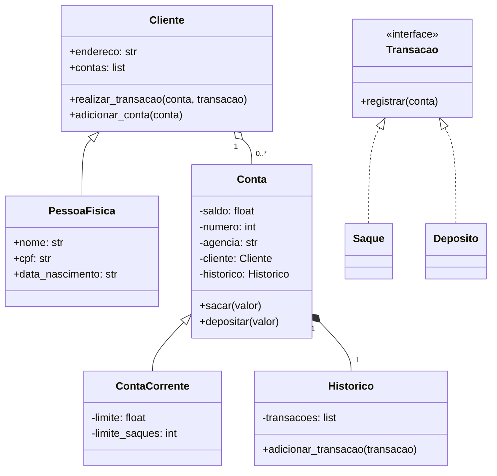

# Sistema Bancário em Python - Desafio V1

Este repositório contém uma implementação de um sistema bancário simples, desenvolvido em Python como parte de um desafio de programação. O projeto utiliza conceitos avançados de Programação Orientada a Objetos (POO) para organizar a lógica de clientes, contas e transações.

## 🚀 Funcionalidades

O sistema permite realizar as seguintes operações através de um menu interativo:

- **Cadastrar Usuário (Cliente):** Registra uma pessoa física com nome, CPF, data de nascimento e endereço.
- **Abrir Conta Corrente:** Vincula uma nova conta a um usuário já cadastrado.
- **Depositar:** Adiciona saldo a uma conta existente.
- **Sacar:** Remove saldo da conta, respeitando:
  - Limite de valor por saque (R$ 500,00).
  - Limite de quantidade de saques diários (3 saques).
  - Saldo disponível.
- **Extrato:** Exibe o histórico de todas as transações realizadas e o saldo atual.
- **Listar Contas:** Mostra todas as contas cadastradas no sistema.

## 🛠️ Tecnologias Utilizadas

- **Python 3.x**
- **Módulos Nativos:**
  - `abc`: Para criação de classes abstratas e interfaces.
  - `datetime`: Para registro de data e hora das transações.
  - `textwrap`: Para formatação de strings e menus.

## 🏗️ Estrutura de Classes (POO)

O projeto foi estruturado seguindo os princípios de POO:

- **Classes Abstratas:** `Transacao` define o contrato para depósitos e saques.
- **Herança:** `PessoaFisica` herda de `Cliente`; `ContaCorrente` herda de `Conta`.
- **Composição:** `Conta` possui um `Historico`; `Cliente` possui uma lista de `Contas`.

### Diagrama de Classes (Simplificado)



## 📋 Como Executar

1. Certifique-se de ter o Python instalado em sua máquina.
2. Clone o repositório ou baixe o arquivo `desafio_v1.py`.
3. Navegue até a pasta do projeto e execute o comando:

```bash
python desafio_v1.py
```

4. Siga as instruções do menu no terminal.

## ✒️ Autor

Projeto desenvolvido como parte do desafio de codificação em Python.